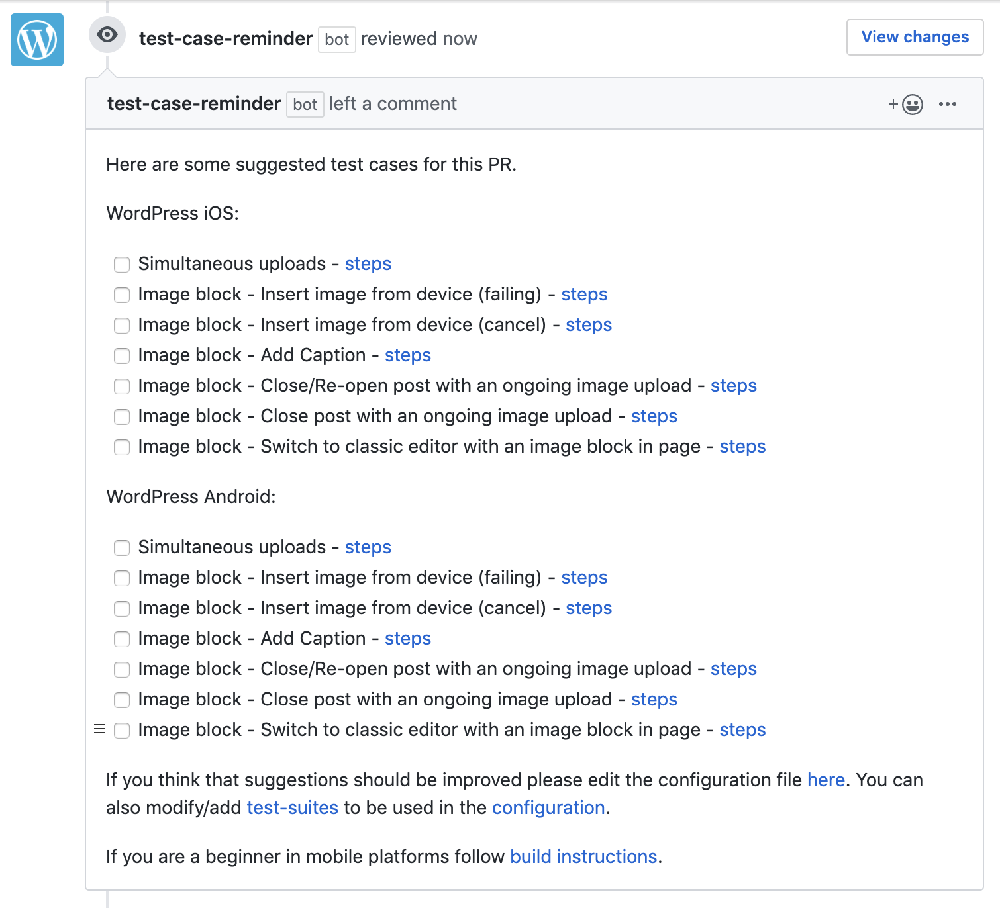

# Test Case Reminder Bot

A GitHub bot that drops a comment into the PR about what to test when specific files change. It is done by providing source file to test-suite mapping, and the test-suite files itself.



## Configuration

By default, this bot will look into [wordpress-mobile/test-cases repo](https://github.com/wordpress-mobile/test-cases) for test cases and [file mapping](https://github.com/wordpress-mobile/test-cases/blob/master/config/mapping.json).

It is possible to override default configuration by adding a `.github/test-case-reminder.json` into a repository where this bot is installed. Config accepts 3 parameters: 

- `tests_repo` - Repository with test suites and `mapping.json`
- `tests_dir` - Path to test-suites directory
- `mapping_file` - Path to `mapping.json` file

Example config:

```json
{
  "tests_repo": "brbrr/jetpack",
  "tests_dir": "docs/regression-checklist/test-suites/",
  "mapping_file": "docs/regression-checklist/mapping.json"
}
```

## Contribution

### Install

To run the code, make sure you have [Bundler](http://gembundler.com/) installed; then enter `bundle install` on the command line.

### Set environment variables

1. Create a copy of the `.env-example` file called `.env`.
2. Create a test app with the following permissions: "Read access to code", "Read access to metadata", "Read and write access to pull requests"
3. Add your GitHub App's private key, app ID, and webhook secret to the `.env` file.

### Run the server

1. Run `bundle exec ruby server.rb` on the command line.
2. View the default Sinatra app at `localhost:3000`.

### Develop

[This guide](https://developer.github.com/apps/quickstart-guides/setting-up-your-development-environment/) will walk through the steps needed to configure a GitHub App and run it on a server.

After completing the necessary steps in the guide you can use this command in this directory to run the smee client(replacing `https://smee.io/4OcZnobezZzAyaw` with your own domain):

> smee --url https://smee.io/4OcZnobezZzAyaw --path /event_handler --port 3000

### Reload Changes

If you want server to reload automatically as you save the file  you can start the server as below instead of using `ruby server.rb`:

> bundle exec rerun 'ruby server.rb'

### Unit tests

Unit tests live in `unittest.rb`

If you want to test potential changes to [mapping.json](https://github.com/wordpress-mobile/test-cases/blob/master/config/mapping.json) file you can first apply the changes to `test_mapping.json` in this repo and test in your local as explained below.

- Checkout this repo
- Change `test_mapping.json`
- Change `unittests.rb` [this line](https://github.com/wordpress-mobile/test-case-reminder-bot/blob/e12c02305f31bf6c3c6d76f9f3d370c0b4703d3e/unittests.rb#L27) with the filenames you want to test with.
- Change assertions accordingly

Run below command to run unittests:

> ruby unittests.rb
